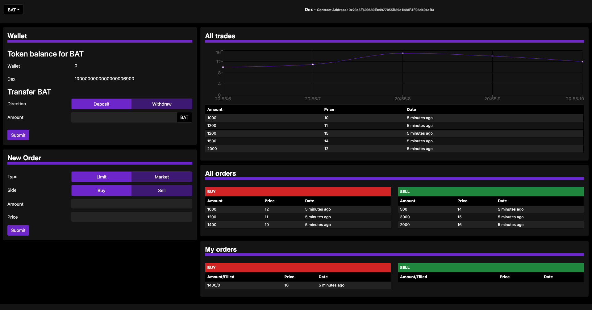

# DEX on Ethereum

Decentralized exchange built with Solidity and the Truffle framework for Ethereum. The exchange uses an order book to create trades.

The front-end uses the React framework to allow users to interact with the smart contract.

Users are able to:
- Select a token to trade
- Deposit tokens from their wallet into the dex to then trade
- Withdraw tokens out of the dex back into their wallet
- Set limit buy/sell orders
- Set market buy/sell orders

#### Screenshot of Finished Project
